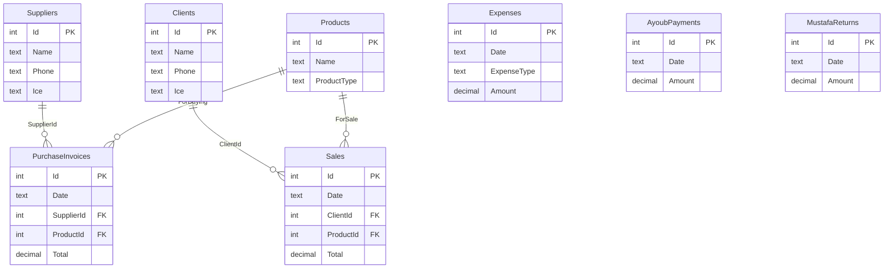

# Recyclage — Database Design

Design document based on the handwritten ledger tables (فاتورة المشتريات، المبيعات، المصاريف، حساب آخر شهر، حساب بين شريكي، فاتورة زبون، فاتورة الفرنيسور).

**Database engine (suggested):** SQLite  
**Money fields:** `DECIMAL(18,2)` — stored in Moroccan dirhams (DH)  
**Dates:** `TEXT` (ISO `YYYY-MM-DD`) or `DATE`

---

## Table groups

### Setup — user maintains (3 tables)

| Table | Arabic | Fields user fills |
|-------|--------|-------------------|
| `Clients` | الزبائن | Name, Phone, ICE |
| `Suppliers` | الموردون | Name, Phone, ICE |
| `Products` | المنتجات | Name + type (`ForBuying` / `ForSale`) |

### Daily entry — user types rows (5 tables)

| Table | Arabic |
|-------|--------|
| `PurchaseInvoices` | فاتورة المشتريات |
| `Sales` | مبيعات |
| `Expenses` | **فاتورة المصاريف** |
| `AyoubPayments` | دفع لي أيوب (حساب الشركاء — أيوب) |
| `MustafaReturns` | رجوع لمصطفى (حساب الشركاء — مصطفى) |

### Reports — system computes (3 views)

| View | Arabic | Source |
|------|--------|--------|
| `MonthlyClosingReport` | حساب في آخر شهر | `Sales` + `PurchaseInvoices` + `Expenses` + `AyoubPayments` + `MustafaReturns` by month |
| `SupplierInvoiceReport` | فاتورة الفرنيسور | `PurchaseInvoices` by `SupplierId` |
| `CustomerInvoiceReport` | فاتورة زبون | `Sales` by `ClientId` |

**Total physical tables: 8** (3 setup + 5 entry)  
**Total views: 3**

Product type on **`Products` only:** `CHECK (ProductType IN ('ForBuying', 'ForSale'))`. No separate expense-types table.

---

## Full diagram

```
                         RECYCLAGE DATABASE (SQLite)
                                 │
         ┌───────────────────────┼───────────────────────┐
         │                       │                       │
   STORED (8 tables)        USER TYPES DAILY        COMPUTED (3 views)
         │                       │                       │
  Clients ──────────────► Sales ──┼──► CustomerInvoiceReport
  Suppliers ────► PurchaseInvoices ──► SupplierInvoiceReport
  Products ─────────────► (both)  │
                                  ├── Expenses  ← فاتورة المصاريف
                                  ├── AyoubPayments   ← دفع لي أيوب
                                  ├── MustafaReturns  ← رجوع لمصطفى
                                  └──► MonthlyClosingReport
```

---

## Entity relationship


```mermaid
erDiagram
    Suppliers ||--o{ PurchaseInvoices : SupplierId
    Clients ||--o{ Sales : ClientId
    Products ||--o{ PurchaseInvoices : ForBuying
    Products ||--o{ Sales : ForSale

    Clients {
        int Id PK
        text Name
        text Phone
        text Ice
    }

    Suppliers {
        int Id PK
        text Name
        text Phone
        text Ice
    }

    Products {
        int Id PK
        text Name
        text ProductType
    }

    PurchaseInvoices {
        int Id PK
        text Date
        int SupplierId FK
        int ProductId FK
        decimal Total
    }

    Sales {
        int Id PK
        text Date
        int ClientId FK
        int ProductId FK
        decimal Total
    }

    Expenses {
        int Id PK
        text Date
        text ExpenseType
        decimal Amount
    }

    AyoubPayments {
        int Id PK
        text Date
        decimal Amount
    }

    MustafaReturns {
        int Id PK
        text Date
        decimal Amount
    }
```

---

## فاتورة المصاريف → `Expenses` table

Your notebook columns map directly:

```
╔══════════════════════════════════════════════════════════╗
║              فاتورة المصاريف  →  Expenses              ║
╠═══════════════╦══════════════════════╦═══════════════════╣
║    الواجب     ║    نوع المصاريف      ║      تاريخ        ║
╠═══════════════╬══════════════════════╬═══════════════════╣
║    Amount     ║    ExpenseType       ║      Date         ║
╚═══════════════╩══════════════════════╩═══════════════════╝
         (read right → left in Arabic UI)
```

| Notebook | DB column | Type |
|----------|-----------|------|
| تاريخ | `Date` | TEXT |
| نوع المصاريف | `ExpenseType` | TEXT (e.g. إيجار، وقود، صيانة) |
| الواجب | `Amount` | DECIMAL(18,2) |

No FK — user types expense type as text on each row. No `ExpenseTypes` lookup table.

---

## Stored schema (ASCII)

```
┌─────────────────┐   ┌─────────────────┐   ┌──────────────────────────────┐
│     Clients     │   │    Suppliers    │   │          Products            │
├─────────────────┤   ├─────────────────┤   ├──────────────────────────────┤
│ Id, Name        │   │ Id, Name        │   │ Id, Name                     │
│ Phone, Ice      │   │ Phone, Ice      │   │ ProductType CHECK            │
└────────┬────────┘   └────────┬────────┘   │  ('ForBuying','ForSale')     │
         │ ClientId            │ SupplierId └──────────────┬───────────────┘
         ▼                     ▼                           │ ProductId
┌─────────────────┐   ┌─────────────────┐                 │
│      Sales      │   │PurchaseInvoices │◄────────────────┘
└─────────────────┘   └─────────────────┘

┌────────────────────────────┐   ┌────────────────────────────┐
│         Expenses           │   │        AyoubPayments       │
│    (فاتورة المصاريف)       │   │       (دفع لي أيوب)        │
├────────────────────────────┤   ├────────────────────────────┤
│ Id                      PK │   │ Id                      PK │
│ Date          ← تاريخ      │   │ Date          ← تاريخ      │
│ ExpenseType   ← نوع المصاريف│   │ Amount        ← المبلغ     │
│ Amount        ← الواجب     │   │ Details       ← التفاصيل   │
│ Description                │   │ CreatedAt                  │
│ CreatedAt                  │   └────────────────────────────┘
└────────────────────────────┘   ┌────────────────────────────┐
                                 │       MustafaReturns       │
                                 │      (رجوع لمصطفى)         │
                                 ├────────────────────────────┤
                                 │ Id                      PK │
                                 │ Date          ← تاريخ      │
                                 │ Amount        ← المبلغ     │
                                 │ Details       ← التفاصيل   │
                                 │ CreatedAt                  │
                                 └────────────────────────────┘
```

---

## Setup tables

### `Clients` — الزبائن

| Column | Arabic | Type |
|--------|--------|------|
| `Id` | — | INTEGER PK |
| `Name` | الاسم | TEXT |
| `Phone` | الهاتف | TEXT |
| `Ice` | ICE | TEXT |

### `Suppliers` — الموردون

| Column | Arabic | Type |
|--------|--------|------|
| `Id` | — | INTEGER PK |
| `Name` | الاسم | TEXT |
| `Phone` | الهاتف | TEXT |
| `Ice` | ICE | TEXT |

### `Products` — المنتجات

| Column | Arabic | Type | Notes |
|--------|--------|------|-------|
| `Id` | — | INTEGER | PK |
| `Name` | الاسم / النوع | TEXT | |
| `ProductType` | للشراء / للبيع | TEXT | `CHECK IN ('ForBuying', 'ForSale')` |
| `DefaultUnit` | الوحدة | TEXT | |
| `DefaultUnitPrice` | ثمن افتراضي | DECIMAL(18,2) | |
| `IsActive` | — | INTEGER | |
| `CreatedAt` | — | TEXT | |

---

## Entry tables

### `PurchaseInvoices` — فاتورة المشتريات

| Column | Arabic | Type |
|--------|--------|------|
| `Date` | تاريخ | TEXT |
| `Quantity` | الكمية | DECIMAL(18,3) |
| `ProductId` | منتج | INTEGER FK → `Products` (**ForBuying**) |
| `SupplierId` | مورد | INTEGER FK → `Suppliers` |
| `UnitPrice` | ثمن | DECIMAL(18,2) |
| `TransportCost` | نقل | DECIMAL(18,2) |
| `Total` | المجموع ب DH | DECIMAL(18,2) |
| `Paid` | دفع | DECIMAL(18,2) |
| `Remaining` | الباقي | DECIMAL(18,2) |

### `Sales` — مبيعات

| Column | Arabic | Type |
|--------|--------|------|
| `Date` | تاريخ | TEXT |
| `Quantity` | الكمية | DECIMAL(18,3) |
| `ProductId` | منتج | INTEGER FK → `Products` (**ForSale**) |
| `ClientId` | زبون | INTEGER FK → `Clients` |
| `UnitPrice` | ثمن | DECIMAL(18,2) |
| `TransportCost` | نقل | DECIMAL(18,2) |
| `Total` | المجموع ب DH | DECIMAL(18,2) |
| `Paid` | دفع | DECIMAL(18,2) |
| `Remaining` | الباقي | DECIMAL(18,2) |

### `Expenses` — فاتورة المصاريف

| Column | Arabic | Type | Notes |
|--------|--------|------|-------|
| `Id` | — | INTEGER | PK |
| `Date` | تاريخ | TEXT | NOT NULL |
| `ExpenseType` | نوع المصاريف | TEXT | NOT NULL — free text per row |
| `Amount` | الواجب | DECIMAL(18,2) | NOT NULL |
| `Description` | — | TEXT | Optional |
| `CreatedAt` | — | TEXT | Audit |

**Index:** `Date`, `ExpenseType`

### `AyoubPayments` — دفع لي أيوب

| Column | Arabic | Type | Notes |
|--------|--------|------|-------|
| `Id` | — | INTEGER | PK |
| `Date` | تاريخ | TEXT | NOT NULL |
| `Amount` | دفع لي أيوب | DECIMAL(18,2) | NOT NULL |
| `Details` | التفاصيل | TEXT | NOT NULL — kept for existing data, not shown on the page |
| `CreatedAt` | — | TEXT | Audit |

**Index:** `Date`

### `MustafaReturns` — رجوع لمصطفى

| Column | Arabic | Type | Notes |
|--------|--------|------|-------|
| `Id` | — | INTEGER | PK |
| `Date` | تاريخ | TEXT | NOT NULL |
| `Amount` | رجوع لمصطفى | DECIMAL(18,2) | NOT NULL |
| `Details` | التفاصيل | TEXT | NOT NULL — kept for existing data, not shown on the page |
| `CreatedAt` | — | TEXT | Audit |

**Index:** `Date`

Each ledger is independent: «الباقي» is computed in the app as the running total of that table's `Amount`, and is never stored.

---

## Computed views

### `MonthlyClosingReport` — حساب في آخر شهر

Computed in `MonthlyClosingReportViewModel` for the selected month (kept as the `MonthlyClosingReport` logical view for the notebook layout).

| Column | Arabic | Computed from |
|--------|--------|---------------|
| `MonthlyPurchases` | دخول في شهر | `SUM(PurchaseInvoices.Total)` of the selected month |
| `Expenses` | المصاريف في شهر | `SUM(Expenses.Amount)` of the selected month |
| `TotalIncomePurchases` | المجموعة (د+م) | month purchases + month expenses |
| `MonthlySales` | خروج في شهر | `SUM(Sales.Total)` of the selected month |
| `AyoubPayments` | دفع لي أيوب | `SUM(AyoubPayments.Amount)` over **all** rows — same number as the «دفع لي أيوب» page total |
| `MustafaReturns` | رجوع لمصطفى | `SUM(MustafaReturns.Amount)` over **all** rows — same number as the «رجوع لمصطفى» page total |
| `CapitalRemaining` | الباقي | month sales − (month purchases + month expenses) |
| `CompanyBalance` | رأس مال الشركة | `AppSettings.CompanyCapital` + cumulative (sales − purchases − expenses) up to the end of the selected month |

### `SupplierInvoiceReport` / `CustomerInvoiceReport`

Unchanged — filtered views on `PurchaseInvoices` / `Sales`.

---

## Notebook → database

| Notebook | DB |
|----------|-----|
| فاتورة المشتريات | `PurchaseInvoices` |
| مبيعات | `Sales` |
| **فاتورة المصاريف** | **`Expenses`** |
| حساب بين شريكي (أيوب) | `AyoubPayments` |
| حساب بين شريكي (مصطفى) | `MustafaReturns` |
| حساب آخر شهر | `MonthlyClosingReport` (view) |
| فاتورة الفرنيسور | `SupplierInvoiceReport` (view) |
| فاتورة زبون | `CustomerInvoiceReport` (view) |

---

## Changelog

| Date | Change |
|------|--------|
| 2026-09-28 | **Split `PartnerTransactions` into two independent tables**: `AyoubPayments` (دفع لي أيوب) and `MustafaReturns` (رجوع لمصطفى) — one table per partner ledger page. Existing rows were copied by SQL inside the migration, then the combined table was dropped. Money moved: 57000.00 → `AyoubPayments`, 2000.00 → `MustafaReturns`. 8 stored tables, 3 views. |
| 2026-09-23 | **Restored `Expenses` table** for فاتورة المصاريف (Date, ExpenseType, Amount). 7 stored tables, 3 views. |
